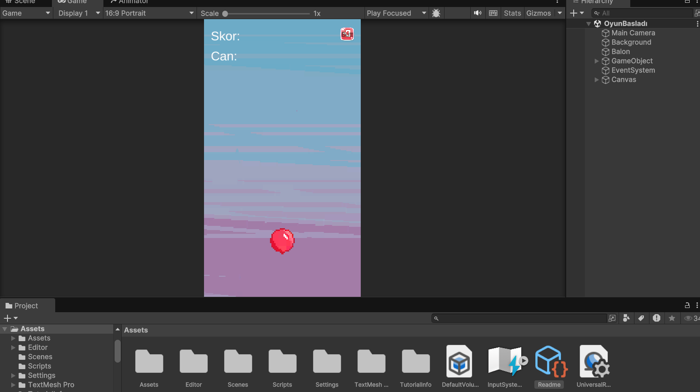
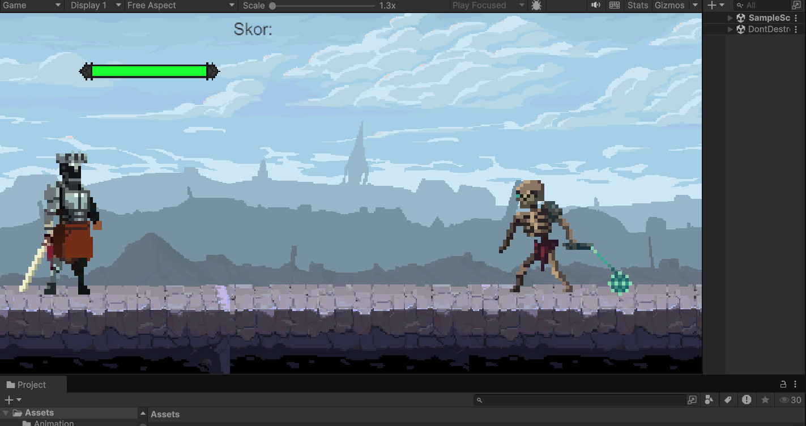

# 🎮 OyunProjelerim

Merhaba! Ben **Ayşe Nur Barut**, 3. sınıf Bilgisayar Mühendisliği öğrencisiyim. Oyun geliştirme tutkusu ile Unity, C#, Blender gibi araçlarla çeşitli projeler geliştiriyorum. Bu repoda oyun geliştirme süreçlerimi, projelerimi ve kodlarımı bulabilirsiniz.

## 🚀 Projeler
- **UçUçBalon** - 2D oyun, Unity ile geliştirildi 
- **İskeleti Öldür** - 2d Platfrom oyunu,Unity ile geliştirildi 
- **[Proje Adı 3]** - Kısa açıklama (örn: 3D macera oyunu, Blender ile tasarlanmış modeller içerir.)

## 🛠️ Kullanılan Teknolojiler
- **Unity** - Oyun motoru  
- **C#** - Programlama dili  

## 📸 Ekran Görüntüleri
### 🎮 UçUçBalon

### 🎮 İskeleti Öldür

